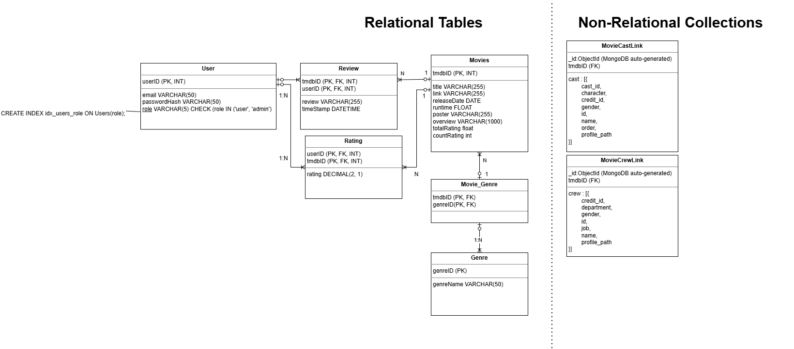

# MooV

## 🎬 Overview
A **hybrid DBMS** that combines **MySQL** and **MongoDB** to efficiently manage a comprehensive movie rating platform with 45,000+ movies and 400,000+ user ratings.

## Architecture
- **MySQL (Relational):** Structured data including movies, users, ratings, genres, reviews
- **MongoDB (Non-Relational):** Unstructured data including movie crew and cast information

## Key Features
- **Multi-tier user system:** Guest, registered user, and admin roles with granular permissions
- **Performance optimization:** Denormalized rating aggregations for sub-second query response
- **Scalable design:** Hybrid approach leverages strengths of both SQL and NoSQL databases
- **Data integrity:** MySQL ensures ACID compliance for critical transactional data
- **Real-time rating system:** Instant updates with aggregated movie ratings
- **Comprehensive movie details:** Including release dates, runtime, and overview
- **User review system:** Timestamped reviews with user authentication

## 🗃️ Database Schema

### Movies
```sql
CREATE TABLE Movies (
  tmdbID int NOT NULL,
  title text,
  link text,
  runtime int DEFAULT NULL,
  poster text,
  overview text,
  totalRatings double NOT NULL DEFAULT '0',
  countRatings int NOT NULL DEFAULT '0',
  releaseDate date DEFAULT NULL,
  PRIMARY KEY (tmdbID)
);
```

### Genre
```sql
CREATE TABLE Genre (
  genreID int NOT NULL,
  genreName varchar(100) DEFAULT NULL,
  PRIMARY KEY (genreID)
);
```

### Movie_Genre
```sql
CREATE TABLE Movie_Genre (
  tmdbID int NOT NULL,
  genreID int NOT NULL,
  PRIMARY KEY (tmdbID,genreID),
  CONSTRAINT fk_movie_genre_genreid FOREIGN KEY (genreID) 
    REFERENCES Genre (genreID) ON DELETE CASCADE ON UPDATE CASCADE,
  CONSTRAINT fk_movie_genre_tmdbid FOREIGN KEY (tmdbID) 
    REFERENCES Movies (tmdbID) ON DELETE CASCADE ON UPDATE CASCADE
);
```

### Users
```sql
CREATE TABLE Users (
  userID int NOT NULL AUTO_INCREMENT,
  passwordHash varchar(255) NOT NULL,
  email varchar(255) NOT NULL,
  role varchar(5) NOT NULL DEFAULT 'user',
  PRIMARY KEY (userID),
  UNIQUE KEY Email (email),
  CONSTRAINT Users_chk_1 CHECK (role in ('user','admin'))
);
```

### Ratings
```sql
CREATE TABLE Ratings (
  userID int NOT NULL,
  tmdbID int NOT NULL,
  rating decimal(2,1) DEFAULT NULL,
  PRIMARY KEY (userID,tmdbID),
  CONSTRAINT fk_ratings_tmdbid FOREIGN KEY (tmdbID) 
    REFERENCES Movies (tmdbID) ON DELETE CASCADE ON UPDATE CASCADE,
  CONSTRAINT fk_ratings_userid FOREIGN KEY (userID) 
    REFERENCES Users (userID) ON DELETE RESTRICT ON UPDATE CASCADE,
  CONSTRAINT Ratings_chk_1 CHECK (rating >= 0 AND rating <= 5)
);
```

### Reviews
```sql
CREATE TABLE Reviews (
  userID int NOT NULL,
  tmdbID int NOT NULL,
  review text,
  timeStamp datetime NOT NULL DEFAULT CURRENT_TIMESTAMP,
  PRIMARY KEY (userID,tmdbID),
  CONSTRAINT fk_reviews_tmdbid FOREIGN KEY (tmdbID) 
    REFERENCES Movies (tmdbID) ON DELETE CASCADE ON UPDATE CASCADE,
  CONSTRAINT fk_reviews_userid FOREIGN KEY (userID) 
    REFERENCES Users (userID) ON DELETE RESTRICT ON UPDATE CASCADE
);
```

### Relational & Non-Relational Dataset
To download the dataset and .sql dumps:
[INF2003 Movies Dataset](https://www.kaggle.com/datasets/ziqiangg/inf2003moviesdataset)

## Setup Instructions

### Prerequisites
- Ensure that you are using **python version 3.14**.
- MySQL Server 8.0 CE
- MongoDB Compass 1.48.0

### Installation
Ensure that you are using **python version 3.14**.

1. **Clone the repository**
```bash
git clone https://github.com/ziqiangg/inf2003DBMS.git
cd inf2003DBMS
```

2. **Create a Python virtual environment**
```bash
python -m venv venv
```

3. **Activate the virtual environment**
- Windows:
```bash
.\venv\Scripts\activate
```
- Unix/MacOS:
```bash
source venv/bin/activate
```

4. **Install required dependencies**
```bash
pip install -r requirements.txt
```

5. **Configure the database connections**
- Edit `database/db_connection.py` for MySQL settings
- Edit `database/db_mongo_connection.py` for MongoDB settings

6. **Initialize the databases**
- Create MySQL database:
```sql
CREATE DATABASE INF2003_DBS_P1_20;
USE INF2003_DBS_P1_20;
```
- Run the schema creation scripts in MySQL Workbench or command line

### Testing the Setup

1. **Test database connections**
```bash
python test_connections.py
```
This will verify both MySQL and MongoDB connections are working properly.

## 📱 Using the Application

### Starting the Application
```bash
python main.py
```

### User Roles and Features

#### Guest Users
- Browse movies
- View movie details and ratings
- Search for movies by title
- View aggregated ratings

#### Registered Users (Additional Features)
- Rate movies (0-5 stars)
- Write movie reviews
- Edit/delete own ratings and reviews
- Maintain a personal profile

#### Administrators (Additional Features)
- Manage user accounts
- Moderate reviews
- Add/edit movie information
- Access system statistics

### Main Features

1. **Movie Browsing**
   - Navigate through pages of movies
   - Filter by genre
   - Sort by rating, release date
   - Search by title

2. **Movie Details**
   - View comprehensive movie information
   - See poster, runtime, and release date
   - Read user reviews
   - Check average rating

3. **User System**
   - Register new account
   - Login/logout functionality
   - Profile management
   - Password security

4. **Rating System**
   - Rate movies from 0 to 5 stars
   - View personal rating history
   - See aggregated ratings
   - Rating restrictions and validations

5. **Review System**
   - Write detailed reviews
   - Edit/delete own reviews
   - View review history
   - Timestamps for all reviews

## 🔧 Troubleshooting

1. **Connection Issues**
   - Verify database credentials in configuration files
   - Check if MySQL and MongoDB services are running
   - Ensure correct IP addresses and ports are configured

2. **Interface Issues**
   - Verify PyQt5 installation
   - Check for proper virtual environment activation
   - Clear application cache if needed

3. **Database Errors**
   - Verify schema installation
   - Check user permissions
   - Validate data integrity

## Project Structure

### `/database`
- Database connection and configuration files
- Repository classes for data access
- Service classes for business logic

### `/gui`
- `gui_home.py` - Main application window
- `gui_movie_detail.py` - Movie details page
- `gui_profile.py` - User profile management
- Other UI component files

### `/images`
- Application assets
- Movie posters
- UI elements

## Project Architecture
